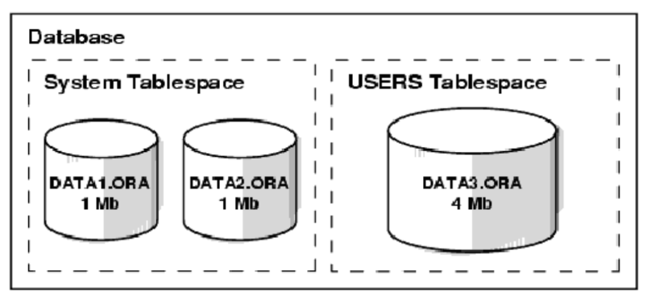

# Oracle database
```
Oracle database là tập hợp các dữ liệu được xem như một đơn vị thành phần (Unit). Database
có nhiệm vụ lưu trữ và trả về các thông tin liên quan. Database được xem xét dưới hai góc độ
cấu trúc logic và cấu trúc vật lý . Tuy vậy, hai cấu trúc dữ liệu này vẫn tồn tại tách biệt nhau,
việc quản lý dữ liệu theo cấu trúc lưu trữ vật lý không gây ảnh hưởng tới cấu trúc logic
Oracle database được xác định bởi tên một tên duy nhất và được quy định trong tham số
DB_NAME của parameter file.
```
## Cấu trúc vật lí database
Cấu trúc vật lý bao gồm tập hợp các control file, online redo log file và các datafile

### Datafiles
```
Mỗi một Oracle database đều có thể có một hay nhiều datafiles. Các database datafiles chứa
toàn bộ dữ liệu trong database. Các dữ liệu thuộc cấu trúc logic của database như tables hay
indexes đều được lưu trữ dưới dạng vật lý trong các datafiles của database.
Một số tính chất của datafiles:
▪ Mỗi datafile chỉ có thể được sử dụng trong một database.
▪ Bên cạnh đó, datafiles cũng còn có một số tính chất cho phép tự động mở rộng kích
thước mỗi khi database hết chỗ lưu trữ dữ liệu.
▪ Một hay nhiều datafiles tạo nên một đơn vị lưu trữ logic của database gọi là tablespace.
▪ Một datafile chỉ thuộc về một tablespace.
Dữ liệu trong một datafile có thể đọc ra và lưu vào vùng nhớ bộ đệm của Oracle. Ví dụ: khi
một user muốn truy cập dữ liệu trong một table thuộc database. Trong trường hợp thông tin
yêu cầu không có trong cache memory hiện thời, nó sẽ được đọc trực tiếp từ các datafiles ra
và lưu trữ vào trong bộ nhớ.
Tuy nhiên, việc bổ sung hay thêm mới dữ liệu vào database không nhất thiết phải ghi ngay
vào các datafile. Các dữ liệu có thể tạm thời ghi vào bộ nhớ để giảm thiểu việc truy xuất tới
bộ nhớ ngoài (ổ đĩa) làm tăng hiệu năng sử dụng hệ thống. Công việc ghi dữ liệu này được
thực hiện bởi DBWn background process.
```

### Redo log files
```
Mỗi Oracle database đều có một tập hợp từ 02 redo log files trở lên. Các redo log files trong
database thường được gọi là database's redo log. Một redo log được tạo thành từ nhiều redo
entries (gọi là các redo records).
Chức năng chính của redo log là ghi lại tất cả các thay đổi đối với dữ liệu trong database.
Redo log files được sử dụng để bảo vệ database khỏi những hỏng hóc do sự cố. Oracle cho
phép sử dụng cùng một lúc nhiều redo log gọi là multiplexed redo log để cùng lưu trữ các bản
sao của redo log trên các ổ đĩa khác nhau.
Các thông tin trong redo log file chỉ được sử dụng để khôi phục lại database trong trường hợp
hệ thống gặp sự cố và không cho phép viết trực tiếp dữ liệu trong database lên các datafiles
trong database. Ví dụ: khi có sự cố xảy ra như mất điện bất chợt chẳng hạn, các dữ liệu trong
bộ nhớ không thể ghi trực tiếp lên các datafiles và gây ra hiện tượng mất dữ liệu. Tuy nhiên,
tất cả các dữ liệu bị mất này đều có thể khôi phục lại ngay khi database được mở trở lại. Việc
này có thể thực hiện được thông qua việc sử dụng ngay chính các thông tin mới nhất có trong
các redo log files thuộc datafiles. Oracle sẽ khôi phục lại các database cho đến thời điểm
trước khi xảy ra sự cố.
Công việc khôi phục dữ liệu từ các redo log được gọi là rolling forward.
```

### Control files
```
Mỗi Oracle database đều có ít nhất một control file. Control file chứa các mục thông tin quy
định cấu trúc vật lý của database như:
▪ Tên của database.
▪ Tên và nơi lưu trữ các datafiles hay redo log files.
▪ Time stamp (mốc thời gian) tạo lập database, ...
Mỗi khi nào một instance của Oracle database được mở, control file của nó sẽ được sử dụng
để xác định data files và các redo log files đi kèm. Khi các thành phần vật lý cả database bị
thay đổi (ví dụ như, tạo mới datafile hay redo log file), Control file sẽ được tự động thay đổi
tương ứng bởi Oracle.
Control file cũng được sử dụng đến khi thực hiện khôi phục lại dữ liệu.
```

## Cấu trúc logic database
Cấu trúc logic của Oracle database bao gồm các đối tượng tablespaces, schema objects, data
blocks, extents, và segments.

### Tablesspace
Một database có thể được phân chia về mặt logic thành các đơn vị gọi là các tablespaces,
Tablespaces thường bao gồm một nhóm các thành phần có quan hệ logic với nhau.



Có một số điểm ta cần quan tâm:
▪ Mỗi database có thể phân chia về mặt logic thành một hay nhiều tablespace.
▪ Mỗi tablespace có thể được tạo nên, về mặt vật lý, bởi một hoặc nhiều datafiles.
▪ Kích thước của một tablespace bằng tổng kích thước của các datafiles của nó. Ví dụ:
trong hình vẽ ở trên SYSTEM tablespace có kích thước là 2 MB còn USERS
tablespace có kích thước là 4 MB.
▪ Kích thước của database cũng có thể xác định được bằng tổng kích thước của các
tablespaces của nó. Ví dụ: trong hình vẽ trên thì kích thước của database là 6 MB.

### Schema và Schema Objects
```
Schema là tập hợp các đối tượng (objects) có trong database. Schema objects là các cấu trúc
logic cho phép tham chiếu trực tiếp tới dữ liệu trong database. Schema objects bao gồm các
cấu trúc như tables, views, sequences, stored procedures, synonyms, indexes, clusters, và
database links.
```

### Data Blocks, Extents, and Segments
Oracle điểu khiển không gian lưu trữ trên đĩa cứng theo các cấu trúc logic bao gồm các data
blocks, extents, và segments.
Oracle Data Blocks
```
Là mức phân cấp logic thấp nhất, các dữ liệu của Oracle database được lưu trữ trong các data
blocks. Một data block tương ứng với một số lượng nhất định các bytes vật lý của database
trong không gian đĩa cứng. Kích thước của một data block được chỉ ra cho mỗi Oracle
database ngay khi database được tạo lập. Database sử dụng, cấp phát và giải phóng vùng
không gian lưu trữ thông qua các Oracle data blocks.
```

Extents
```
Là mức phân chia cao hơn về mặt logic các vùng không gian trong database. Một extent bao
gồm một số data blocks liên tiếp nhau, cùng được lưu trữ tại một thiết bị lưu giữ. Extent được
sử dụng để lưu trữ các thông tin có cùng kiểu.
```

Segment
```
Là mức phân chia cao hơn nữa về mặt logic các vùng không gian trong database. Một
segment là một tập hợp các extents được cấp phát cho một cấu trúc logic . Segment có thể
được phân chia theo nhiều loại khác nhau:
```

## Các cấu trúc vật lý khác
```
Ngoài ra, Oracle Server còn sử dụng các file khác để lưu trữ thông tin. Các file đó bao gồm:
▪ Parameter file: Parameter file chỉ ra các tham số được sử dụng trong database. Người
quản trị database có thể sửa đổi một vài thông tin có trong file này. Các tham số trong
parameter file được viết ở dạng văn bản.
▪ Password file: Xác định quyền của từng user trong database. Cho phép người sử dụng
khởi động và tắt một Oracle instance.
▪ Archived redo log files: Là bản off line của các redo log files chứa các thông tin cần
thiết để phục hồi dữ liệu.
```